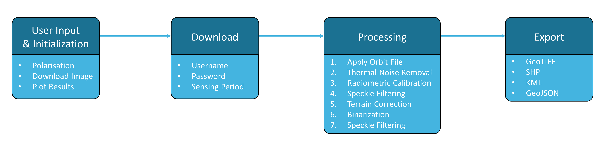

  

# Flood Extent Mapping

  

***

The objective of this [Recommended Practice](https://un-spider.org/advisory-support/recommended-practices/recommended-practice-radar-based-flood-mapping) is to determine the extent of flooded areas. The usage of Synthetic Aperture Radar (SAR) satellite imagery for flood extent mapping constitutes a viable solution with fast image processing, providing near real-time flood information to relief agencies for supporting humanitarian action. The high data reliability as well as the absence of geographical constraints, such as site accessibility, emphasize the technology’s potential in the field.

This Jupyter Notebook covers the full processing chain from data query and download up to the export of a final flood mask product by utilizing open access Sentinel-1 SAR data. The tool's workflow is illustrated below. More detailed information regarding user inputs and processing steps can be found within the Jupyter Notebook.

  

An alternative version has been optimized for the use with Google Colab. As a cloud computing-based environment for Jupyter Notebooks, it takes advantage of external technical resources and thus allows this tool to be applied using devices with limited computing power, including phones and tablets, and in areas with scarce bandwidth. This version can directly be accessed and used by clicking the icon below.  

***

# Tutorial

The tool's workflow is demonstrated using the example of the Ulua Basin, Honduras, after the tropical cyclone Eta with Sentinel-1 data from November 11, 2020. [Click here](https://youtu.be/TYm7hxg3SHg) to see the full tutorial.

  

*This tool was created to support the [UN-SPIDER Knowledge Portal](http://www.un-spider.org/).*   

