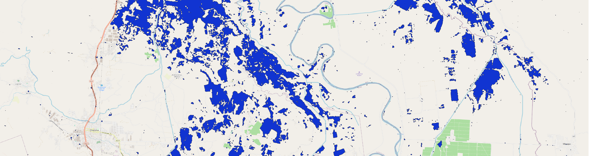
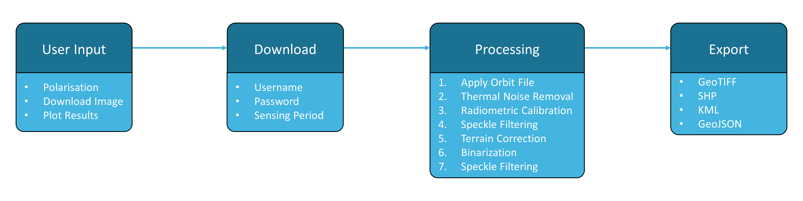

English | [Español](https://github.com/UN-SPIDER/radar-based-flood-mapping-spanish)

  

# Radar-based Flood Mapping

  

***

The objective of this [Recommended Practice](https://un-spider.org/advisory-support/recommended-practices) is to determine the extent of flooded areas. The usage of Synthetic Aperture Radar (SAR) satellite imagery for flood extent mapping constitutes a viable solution with fast image processing, providing near real-time flood information to relief agencies for supporting humanitarian action. The high data reliability as well as the absence of geographical constraints, such as site accessibility, emphasize the technology’s potential in the field.

This [Jupyter Notebook](https://github.com/vhertel/radar-based-flood-mapping/blob/main/radar-based-flood-mapping.ipynb) covers the full processing chain from data query and download up to the export of a final flood mask product by utilizing open access Sentinel-1 SAR data. The tool's workflow follows the UN-SPIDER Recommended Practice on [Radar-based Flood Mapping](https://un-spider.org/advisory-support/recommended-practices/recommended-practice-radar-based-flood-mapping) and is illustrated below. More detailed information regarding user inputs and processing steps can be found within the Jupyter Notebook.

  

Alternative versions have been optimized for the use with [Binder](https://mybinder.org/) and [Google Colab](https://colab.research.google.com/github/tensorflow/examples/blob/master/courses/udacity_intro_to_tensorflow_for_deep_learning/l01c01_introduction_to_colab_and_python.ipynb). As cloud computing-based environments for Jupyter Notebooks, they take advantage of external technical resources and thus allow this tool to be applied using devices with limited computing power, including phones and tablets, and in areas with scarce bandwidth. These versions can directly be accessed and used by clicking the respective icons below.  

 

***

# Tutorial

The tool's workflow is demonstrated using the example of the Ulua Basin, Honduras, after the tropical cyclone Eta with Sentinel-1 data from November 11, 2020. [Click here](https://youtu.be/xCmXTWHH35k?t=1852) to see a full tutorial and [here](https://youtu.be/xCmXTWHH35k?t=1417) for an introduction to the methodology.

  

*This tool was created to support the [UN-SPIDER Knowledge Portal](http://www.un-spider.org/).*   

## Legal notice and disclaimer

<i>"The boundaries and names shown and the designations used on this map do not imply official endorsement or acceptance by the United Nations."</i>
